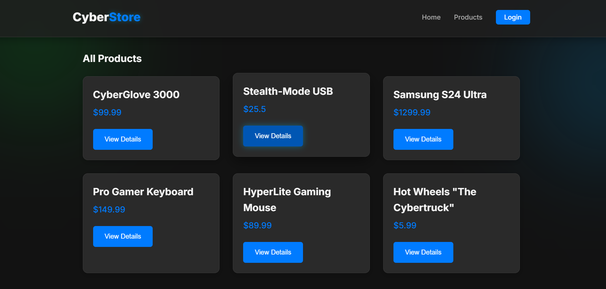
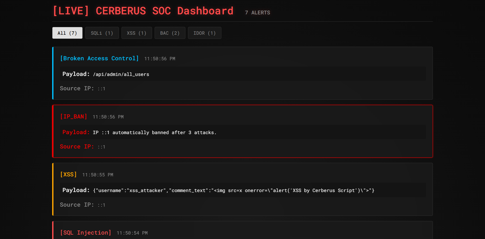

# 🛡️ Project Cerberus

**An interactive, full-stack application demonstrating the "Offense, Defense, and Detection" of the most common web vulnerabilities.**

This project is a complete, hands-on environment. It's not just a vulnerable application; it's a **WAF (Web Application Firewall)**, a **live SOC (Security Operations Center) Dashboard**, and a **vulnerable e-commerce site** all rolled into one.

It actively demonstrates how attacks work, how they are detected in real-time, and how they are blocked by both active defenses (a WAF) and secure coding (patched endpoints).

## 🚀 The Demo in Action

The system is composed of three applications running simultaneously: the vulnerable "CyberStore," the real-time "SOC Dashboard," and an "Attacker Script."

| The "Target" E-commerce Site | The "Live" SOC Dashboard |
| :---: | :---: |
|  |  |
| A full-stack (React/Node.js) e-commerce site built with intentional, critical vulnerabilities. | A live, real-time dashboard that uses WebSockets to display detected attacks *as they happen*. |

---

## 🏛️ System Architecture

Project Cerberus runs as a micro-ecosystem of four components communicating over a local network.


```text
+-------------------+      +-----------------------+      +-------------------------+
|  Attacker Script  |      |  Target Client (React)|      |  SOC Dashboard (React)  |
|   (attack.py)     |      |   (Port: 3000)        |      |   (Port: 3002)          |
+-------------------+      +-----------------------+      +-------------------------+
         |                          |                           |
         | [HTTP Attack]            | [HTTP Requests]           | [WebSocket Connection]
         |                          |                           |
         v                          v                           |
    +-----------------------------------------------------------+
    |                    Server (Node.js/Express)               |
    |                       (Port: 3001)                        |
    |                                                           |
    |  [Guard 1: WAF (IP Blocker)]                              | <==[Emits 'new_attack']
    |  [Guard 2: Detection Middleware (Logs & Emits)]           |
    |                                                           |
    |  [Vulnerable Routes]  |  [Patched Routes]                 |
    +-----------------------------------------------------------+
         |
         | [SQL Read/Write]
         v
    +-------------------+
    |  Database (PSQL)  |
    |  (cerberus_db)    |
    +-------------------+
```

---

## ✨ Key Features

* 🛡️ **Stateful WAF (Web Application Firewall):** An active defense (middleware) that tracks attacks. If an IP hits a threshold (e.g., 3 attacks), it is automatically **banned for 5 minutes**, rejecting all further requests.
* 📡 **Live SOC Dashboard:** A separate React app that connects to the server via **WebSockets** and displays incoming alerts—including a special, pulsing alert for `[IP_BAN]` events.
* 🎯 **Vulnerable "Target" Application:** A "fancy" full-stack e-commerce site (`target-client`) built on React and Node.js.
* 🐍 **Automated Attack Script:** A `attack.py` script that launches all 4 attack types (SQLi, XSS, BAC, IDOR) for a powerful, hands-off demo.
* 🔐 **Patched & Secure Endpoints:** For every vulnerability, a parallel, secure API route (e.g., `/api/login-secure`) is included to demonstrate the correct, modern fix.

---

## 🔧 How to Run

To run this project, you will need 4 terminal windows.

### 1. Prerequisites
* [Node.js](https://nodejs.org/) (v16+)
* [PostgreSQL](https://www.postgresql.org/download/) (and a GUI like pgAdmin or DBeaver)
* [Python](https://www.python.org/downloads/) (v3.6+)

### 2. Database Setup (pgAdmin)
1.  Create a new PostgreSQL database named `cerberus_db`.
2.  Open a Query Tool and run the SQL commands in `project-cerberus/server/database.sql` (Note: You'll need to create this file or just paste the table-creation SQL from our chat).
3.  In `project-cerberus/server/db.js`, update the `password` to match your PostgreSQL password.

### 3. Terminal 1: Start the Backend Server
```bash
# Navigate to the server folder
cd project-cerberus/server

# Install dependencies
npm install

# Start the server (with nodemon)
npm start
# Server is now running on http://localhost:3001
```

### 4. Terminal 2: Start the "Target" E-commerce Site
```bash
# Navigate to the target client folder
cd project-cerberus/target-client

# Install dependencies
npm install

# Start the app
npm start
# App is now running on http://localhost:3000
```

### 5. Terminal 3: Start the "SOC Dashboard"
```bash
# Navigate to the SOC dashboard folder
cd project-cerberus/soc-dashboard

# Install dependencies
npm install

# Start the app
npm start
# Dashboard is now running on http://localhost:3002
```

### 6. Terminal 4: Run the Demo!
Arrange your windows so you can see the SOC Dashboard.
```bash
# Make sure you are in the root folder
cd project-cerberus

# Install Python dependencies
pip install requests

# Run the attack!
python attack.py
```
**Watch the SOC Dashboard light up** as the script runs, and see the `[IP_BAN]` alert appear after the third attack!

---

## 🐛 Vulnerabilities & Patches

This project demonstrates 5 critical vulnerabilities and their corresponding fixes.

### 1. SQL Injection (SQLi)
* **The Vulnerability:** The login route builds a SQL query by directly embedding user input (`username`) into a string. An attacker can inject SQL commands (like `' OR '1'='1' --`) to bypass the password check.
* **The Fix:** Use **Parameterized Queries**. The database driver is given the query *template* (`...$1`) and the *data* (`[username]`) separately. The driver safely inserts the data, making it impossible for it to be executed as code.

| `POST /api/login` (Vulnerable) | `POST /api/login-secure` (Patched) |
| :--- | :--- |
| ```javascript | ```javascript |
| const queryText = | const queryText = |
|   `SELECT * FROM users WHERE ` + |   `SELECT * FROM users WHERE ` + |
|   `username = '${username}' AND ` + |   `username = $1 AND ` + |
|   `password = '${password}'`; |   `password = $2`; |
| | |
| await db.query(queryText); | await db.query(queryText, [username, password]); |
| ``` | ``` |

### 2. Stored Cross-Site Scripting (XSS)
* **The Vulnerability:** The comments endpoint saves user-supplied text (`comment_text`) directly to the database without sanitization. When the comment is rendered, the browser executes any malicious `<script>` or `onerror` tags.
* **The Fix:** **Server-Side Sanitization.** The `/comments-secure` route uses the `xss` library to strip all HTML tags and attributes from the input *before* it is saved to the database.

| `POST .../comments` (Vulnerable) | `POST .../comments-secure` (Patched) |
| :--- | :--- |
| ```javascript | ```javascript |
| const { comment_text } = req.body; | const { comment_text } = req.body; |
| | |
| const queryText = 'INSERT...'; | // --- FIX --- |
| | const sanitizedComment = xss(comment_text); |
| await db.query(queryText, | |
|   [id, username, comment_text] | await db.query(queryText, |
| ); |   [id, username, sanitizedComment] |
| ``` | ); |
| ``` | ``` |

### 3. Broken Access Control (BAC)
* **The Vulnerability:** The `/api/admin/all_users` endpoint has no "guard" middleware. *Any* user, logged-in or not, can access this sensitive URL if they guess it.
* **The Fix:** **Route-Level Middleware.** The `/api/admin/all_users-secure` route is *protected* by an authentication middleware (`fakeAuthAdmin`). This middleware runs *before* the route handler and checks if the user has an `is_admin` flag.

| `GET .../all_users` (Vulnerable) | `GET .../all_users-secure` (Patched) |
| :--- | :--- |
| ```javascript | ```javascript |
| // No middleware, just the handler | // --- FIX --- |
| app.get( | app.get( |
|   '/api/admin/all_users', |   '/api/admin/all_users-secure', |
|   async (req, res) => { |   fakeAuthAdmin, // This guard runs first |
|     //... |   async (req, res) => { |
|   } |     //... |
| ); |   } |
| ``` | ); |
| ``` | ``` |

### 4. Insecure Direct Object Reference (IDOR)
* **The Vulnerability:** The `/api/users/:id` route takes a user ID *from the URL*. It "insecurely" trusts this input. A logged-in user (`id: 1`) can just change the URL to `/api/users/2` to steal the admin's data.
* **The Fix:** **Never Trust User-Supplied IDs.** The `/api/users/my-profile-secure` route *ignores* any ID in the URL. Instead, it gets the user's ID *directly* from their secure, server-side session/token (`req.user.id`).

| `GET /api/users/:id` (Vulnerable) | `GET .../my-profile-secure` (Patched) |
| :--- | :--- |
| ```javascript | ```javascript |
| // --- VULNERABILITY --- | // --- FIX --- |
| const { id } = req.params; | // Get ID from the *session*, not the URL |
| | const userId = req.user.id; |
| const result = await db.query( | |
|   'SELECT * FROM users WHERE id = $1', | const result = await db.query( |
|   [id] // Trusting the URL parameter |   'SELECT * FROM users WHERE id = $1', |
| ); |   [userId] // Using the secure session ID |
| ``` | ); |
| ``` | ``` |

### 5. Sensitive Data Exposure
* **The Vulnerability:** The `/api/login` route returns the *entire* user object from the database, including the `password` field, back to the browser.
* **The Fix:** **Sanitize API Responses.** The `/api/login-secure` route manually builds a *new, safe* `user` object, only including the fields that are safe for the client to have (`id`, `username`, `is_admin`).

| `POST /api/login` (Vulnerable) | `POST /api/login-secure` (Patched) |
| :--- | :--- |
| ```javascript | ```javascript |
| if (result.rows.length > 0) { | if (result.rows.length > 0) { |
|   // --- VULNERABILITY --- | // --- FIX --- |
|   res.json({ | const user = { |
|     message: `Welcome!`, |   id: result.rows[0].id, |
|     user: result.rows[0] // Leaks password! |   username: result.rows[0].username |
|   }); | }; |
| } |   res.json({ |
| |     message: `Welcome!`, |
| |     user: user // Only sends safe data |
| |   }); |
| | } |
| ``` | ``` |


---

## ⚖️ License

Licensed under the **MIT License**.
